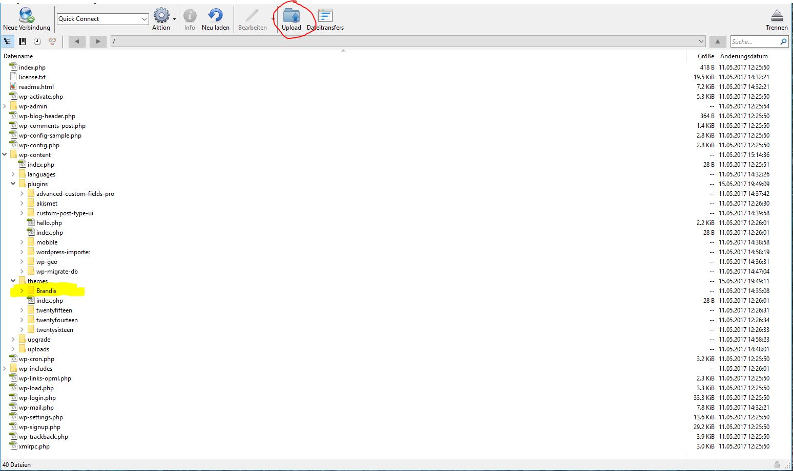
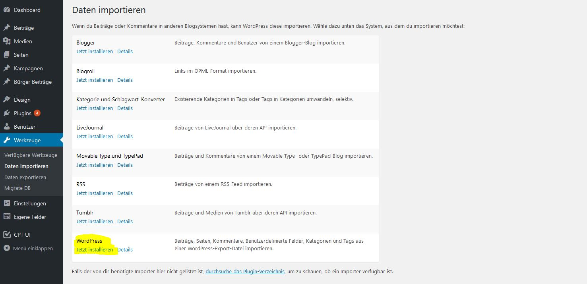

# Geschichtswerkstatt Brandis
App um geschichtliche Beiträge auf einer Karten und Zeitleisten-Ansicht darzustellen.

Benutzt als Backend Wordpress (V 4.6.1)! 

   
   Das Tool funktioniert einwandfrei mit dieser Worpress-Version, andere Wordpress-Versionen wurden nicht getestet, von daher  sollte für den vollen Funktionsumfang WordPress NICHT geupdatet werden!

Beiträge werden zum Einen auf einer Leaflet Map + Zeitleiste dargestellt.

Ausserdem gibt es eine Listenansicht.

Um mit der App zu arbeiten:

1. Wordpress installieren
    - Download der [Wordpress Version 4.6.1](https://wordpress.org/download/release-archive/)
    - Installation nach folgender Anleitung:
      [Wordpress in 5 Minuten istallieren](https://www.blogaufbau.de/wordpress-installieren-in-5-minuten/)
    
2. "Brandis"-Theme über ein FTP-Programm (z.B. [Filezilla](https://filezilla-project.org/) oder [CyberDuck](https://cyberduck.io/)) in das entsprechende Wordpress-Verzeichnis (/wp-content/themes) laden 

3. Alle Plugins über FTP in das entsprechende Wordpress-Verzeichnis (/wp-content/plugins) laden

(Screenshot FTP Wordpress-Verzeichnis)

4. Plugins in WordPress installieren & aktivieren

  Zu installierende Plugins: Advanced Custom Fields Pro, Custom Post Type UI, Mobble, WP-Geo, WP Migrate DB
  
  - advanced-custom-fields-pro lizensieren!
  - Google Api Key für WP-Geo holen!

(So sollte die Pluginübersicht anschließend aussehen (OHNE Address Geocoder und JSON API) )

  
5. Theme "Brandis" in Wordpress aktivieren

(Aktiviertes Brandis-Theme)

6. Beispiel DB-Dump (geschichtswerkstatt.sql) z.B. über [PHPMyAdmin](http://migratetowp.com/faqs/importing-a-sql-file-with-your-wordpress-data/) einspielen

ODER

6. Beispiel-Daten (geschichtswerkstattbrandis.wordpress.xml) über WordPress-Interface -> Werkzeuge/Daten importieren einspielen

(Wordpress Datenimport, dazu zunächst WordPress Datenimport installieren)

Nun müsste es laufen...
Dann kann man Beiträge löschen und eigene Beitäge einspielen.

Demo bzw. Orginal Applikation unter: [Geschichtswerkstatt Brandis](http://geschichtswerkstatt.brandis.eu/)

Weitere Beispielseiten: [Geschichtslab-Plattform](http://geschichtslab.community-infrastructuring.org/)
